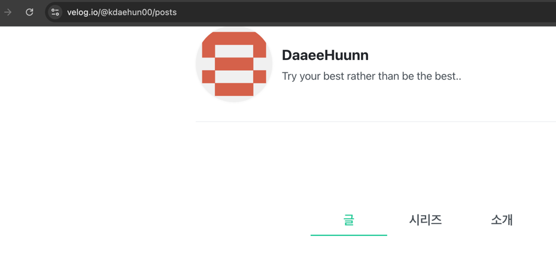

# 아무말 대잔치 - 개인 프로젝트

**아무말 대잔치**는 사용자 인증 및 게시판 기능이 포함된 **웹 애플리케이션**으로, 프론트엔드와 백엔드를 **혼자서 직접 구현**한 프로젝트입니다.  
프론트엔드는 HTML/CSS/JS를 활용하여 기본 UI/UX를 구축하였고, 백엔드는 Java와 Spring Boot 기반의 REST API로 설계되었습니다.

---

## ✅ 프로젝트 개요

> **프로젝트 이름**: 아무말 대잔치
>
> **역할**: 기획, 프론트엔드, 백엔드
>
> **배포**: (추후 예정)

- **개발 기간**: 4주
- **개발 방식**: 개인 프로젝트 (Fullstack)
- **주요 목표**:
    - VanilaJS를 활용한 프론트 엔드 구현
    - Spring Boot 기반 CRUD 게시판 구현
    - AOP, 캐시, 테스트 코드 등 실무 기술 적용

---

## 🛠 사용 기술 스택

### 🔙 Backend

| 기술 | 설명 |
|------|------|
| Java 21 | 백엔드 언어 |
| Spring Boot 3.4.3 | 백엔드 프레임워크 |
| Spring Security | 인증 및 인가 처리 |
| JPA + Hibernate | ORM 기반 DB 접근 |
| Redis | 캐싱 및 성능 최적화 |
| AOP | 로깅 및 성능 모니터링 |
| MySQL 8 | 관계형 데이터베이스 |
| Lombok | 코드 간결화 |
| Mockito | 단위 테스트 작성 |

### 🔜 Frontend

| 기술 | 설명 |
|------|------|
| HTML / CSS / JS | 프론트엔드 구현 |
| Fetch API | 비동기 통신 처리 |
| LocalStorage | 로그인 상태 유지 등 클라이언트 측 저장소 활용 |

---

## ✨ 주요 기능

### 게시판 기능
- 게시글 작성, 수정, 삭제
- 게시글 목록 및 상세 조회 (조회수 증가 포함)
- 댓글 작성 및 삭제
- 좋아요 및 좋아요 취소

### 사용자 인증
- 회원가입 / 로그인 / 로그아웃
- 로그인 여부에 따른 기능 접근 제어
- (예정) JWT 기반 인증 방식 도입

### 성능 최적화
- **Redis 캐시**: 로그인 유저 정보를 캐시에 저장하여 DB 접근 최소화
- **AOP 로깅**: 기능별 실행 시간 측정 및 로그 기록

### 예외 처리
- **GlobalExceptionHandler**: `@RestControllerAdvice` 기반 전역 예외 처리
- **ResponseEntity**: HTTP 상태코드 기반 응답 처리 및 메시지 전달

### 테스트
- 일부 서비스 로직에 대해 Mockito 활용 단위 테스트 작성
- 테스트 과정 중 Agent 경고 해결 경험

---

## 🔍 기술적 고민 및 해결 과정

### 1. 기획 미비 → 프론트-백엔드 연동 문제
- 초기 명확하지 않은 기획과 프론트엔드/백엔드 개발을 병행하다 보니 프론트와 백엔드의 데이터가 불일치허는 경우가 많았습니다.
    
    → **명확한 API 정의와 응답 구조 설계의 중요성**을 체감하였습니다.

    → 향후 팀 프로젝트에서 **명세서 공유 및 협업 플로우**를 확실히 해야겠다고 생각했습니다.

### 2. 캐시 문제
- Redis에 로그인 사용자 `userId`를 캐싱했지만, **로그아웃 시 캐시 삭제 처리 미흡**으로 인해 인증 상태 유지의 어려움이 있었습니다.
- 이는 로그인 상태 관리를 서버에서 함으로써 **Stateless하게 유지할 수 없다**는 단점이 있었습니다.

  → 세션 기반 인증방식을 직접 사용해보니 발생하는 문제점을 더 잘 파악할 수 있었고, **JWT 방식으로 전환**할 필요성을 느꼈습니다.

  → 현재는 구현 전 단계로, 이후 JWT 적용 예정할 예정입니다.

### 3. DTO 남용 → 구조 리팩토링
- 모든 응답에 성공 여부 메시지를 담으려다 보니 **DTO가 과도하게 증가**하는 문제가 있었습니다.
   
    → `ResponseEntity`와 상태 코드를 적극 활용하여 **DTO 수 줄이고 구조 간소화**하였습니다.

### 4. 무한 재귀 호출 이슈
- `Post → User → Post` 형태의 양방향 매핑에서 **무한 순환 참조**가 발생하였습니다.
    
  → 이는 DTO를 활용하여 해결하였습니다.

### 5. 테스트 코드 작성
- Mock 데이터를 활용하여 테스트 코드를 작성해보았습니다.

  → **단순 기능 구현보다 검증 코드 작성이 더 오래 걸림**을 느끼고 사실 처음에는 테스트 코드의 중요성을 잘 몰랐습니다.
    하지만 테스트를 할 때 API가 아닌, 기능 로직을 검증할 때 중요함을 느꼈고,
    무엇보다 **리팩토링** 과정에서 중요성을 느꼈습니다. postman은 성공의 여부만 알려주기 때문에 변경된 코드가 기존과 같은 동작을 하는지 확인하기 어려웠는데,
    테스트코드를 활용하니 기존의 코드와 같은 동작을 하는지 바로 확인할 수 있었습니다. 또, 수동이 아닌 자동으로 확인할 수 있어 더 빠른 테스트가 가능했습니다.

- Mockito로 테스트 작성 도중 발생한 경고를 해결하며 학습을 진행하였습니다.

### 6. AOP + 성능 측정
- AOP를 통해 **각 기능의 실행 시간 로깅** 하였습니다.
- 아직 동작 시간이 짧은 것인지 긴 것인지에 대한 기준점은 부족하지만, 실무에서의 성능 최적화를 위한 첫걸음으로 생각하고 경험해보았습니다.

---

## 📎 작성 글 (Velog)

- [개인 프로젝트 회고](https://velog.io/@kdaehun00/개인-프로젝트)
- [AOP 활용 성능 최적화](https://velog.io/@kdaehun00/AOP-활용-성능-최적화)
- [Mockito 사용 중 Agent 경고](https://velog.io/@kdaehun00/Mockito-동적-Agent-경고)

---

## 🧠 느낀 점 & 성장
### 1. RESTful API를 위한 엔드포인드 고민
- 스스로 생각을 해보다가 감이 잘 잡히지 않아 `velog`라는 게시물 웹사이트를 참고해보았습니다.
- 여기서는 아래와 같이 url에 사용자의 닉네임 뒤에 posts나 제목을 파라미터로 던져 게시물 목록이나 상세 게시물을 들어갈 수 있도록 엔드포인트를 설정하였습니다.
  
  
    - 제목을 수정해도 slug는 변경되지 않고, 예전 제목 그대로 유지되었습니다.
        - 여기서도 궁금증이 생겼습니다. 
          1. slug를 변경하지 않는 이유?
             - 이 과정에서 엔드포인트의 끝 부분을 slug라고 표현한다는 것을 알게 되었습니다.
             - URL이 바뀌면 기존에 공유한 링크, 검색엔진에 등록된 주소, SNS 공유 주소가 모두 깨지게 되므로 변경하지 않는다는 것을 알게 되었습니다.
          2. 제목이 중복되었을 때의 해결방안?
            - 아래와 같이 뒤에 구별할 수 있는 코드로 구분하였습니다.
            
    - 여기서 흥미로운 점은 공백을 -로 대체했다는 것아었습니다. 처음에는 왜 그런 것인지 잘 몰랐는데, 이미지 url을 사용하는 과정에서 오류를 만났던 적이 있어서 이해할 수 있게 되었습니다.
    - SEO, 검색엔진 최적화라는 것도 알게 되었는데, SEO를 높이기 위한 요소들도 공부해보 팀프로젝트에서 활용할 수 있겠다라는 생각을 하였고, URL을 만들 때 다양한 것들을 생각하며 만들어야 함을 느끼게 되었습니다.
- 번외:
    - 이미지 url을 가져오는 과정에서 공백이 있으면 오류가 있었습니다.
    - velog에서는 공백을 -로 변경하는 것이 생각나서 문제의 해결방안을 생각해낼 수 있었습니다.
        - 그 뒤 어떤 웹사이트를 방문할 때, 가끔 url을 어떻게 사용하는지 보게 되었습니다..

### 2. 소통의 중요성. 백엔드는 꼼꼼하고 확실하게 해야한다.
- 처음 해보는 프론트엔드가 너무 낯설고 어렵게 느껴졌지만, 백엔드와 병행하며 **기획의 중요성**, **API 설계의 명확성**, **응답 구조의 일관성**을 느끼게 되었습니다.
  - 힘들었던 점은 `프론트엔드에서 실행했을 때 무언가 동작하지 않으면 프론트엔드에서 잘못한 것인지 백엔드에서 잘못한 것인지 혼란이 온다는 점`이었습니다.
  저는 직접 postman으로 백엔드를 테스트 해볼 수 있기 때문에 비교적 금방 원인을 찾을 수 있었지만, 업무가 분담되어 있었다면 백엔드의 조그만한 실수로 프론트엔드는 엄청난 고생을 할 수 있음을 느꼈습니다.
  이는 기획의 중요성과 꾸준한 소통의 중요성을 느끼게 해주었습니다.

### 3. 실무를 위한 다양한 경험
- 단순히 기능 구현이 아닌, **기능의 확장성**, **보안성**, **유지보수성**을 고려하는 개발자가 되어가고 있음을 느꼈습니다.
- 앞으로도 AOP, 테스트, JWT 등 다양한 기술을 **기능 구현 → 검증 → 개선**의 사이클로 개발역량을 발전시키고 싶습니다.
---

